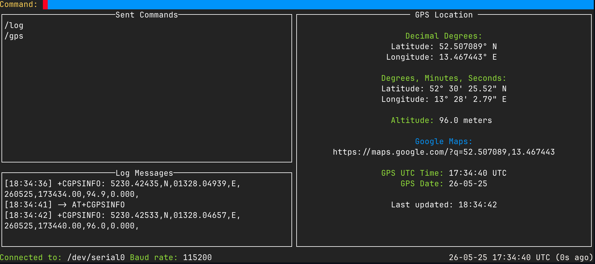

# atcli – Modern AT Command Interface for Modems

## 🧭 Overview

atcli is a modern CLI tool written in Go for interacting with AT command–based cellular and GPS/GNSS modems. It aims to replace traditional tools like minicom and screen with a purpose-built, interruption-free, and modern interface designed for today's development workflows.

## 🤔 Why atcli?

Traditional terminal-based modem interfaces like minicom were designed decades ago and lack many features that modern developers expect:

- **Clean separation of commands and responses** - Unlike minicom where commands and unsolicited messages mix together, atcli clearly separates your input from modem output
- **Interruption-free experience** - No more lost commands when a modem sends unsolicited notifications
- **Modern UX** - Intuitive interface with command history, filtering, and visual cues
- **Developer-friendly** - Built for cellular/IoT developers who work with modems daily

atcli addresses these pain points by providing a specialized tool that understands AT command workflows and modem behavior patterns, making development and debugging significantly more efficient.

## ✨ Core Features (Implemented)

- Serial port connection via go.bug.st/serial
- Interactive REPL-style input
- Command buffer separated from unsolicited modem output
- Will show an arrow `<-` or `->` to indicate if the output is from the modem or from the user
- Will show a line number to indicate the command number so the user can determine something is happening and make it easy to see changes
- Default serial settings: /dev/serial0, 115200 baud

---

## 📌 Roadmap: Planned Features

Some of these features might be removed if they are found to be impossible, or maybe I was just wishfully thinking they would work. I will update this list as I progress.

### 1. 💬 Command Interface
- Input history navigation (up/down arrow) ✅
- Command auto-complete for known AT commands
- Multi-line/multi-command blocks (e.g. send several commands in sequence)
- Graceful Ctrl+C handling with optional cleanup/reset

### 2. 🐛 Debugging Tools
- Signal strength polling (AT+CSQ loop with graph) ✅
- Live registration status
- Detect known error patterns (e.g. SIM failure, boot loops)

### 3. 📌 GPS Features
- GPS location polling (AT+CGPSINFO loop with graph) ✅
- GPS Time

### 4. 📱 Network Information
- Network registration status monitor (AT+CREG, AT+CGREG, AT+CEREG)
- Display network type (2G/3G/4G/5G), registration status, and cell ID
- Network scan tool to show available operators (AT+COPS=?)
- Operator selection interface

### 5. 💳 SIM Card Management
- SIM card information display (AT+CIMI, AT+CCID)
- PIN status and management
- SIM toolkit integration

### 6. ℹ️ Modem Information
- Comprehensive modem information panel (AT+CGMI, AT+CGMM, AT+CGMR)
- IMEI and capability reporting (AT+GSN)
- Firmware version and update status

### 7. 📨 SMS Management
- SMS reading and sending capabilities (AT+CMGR, AT+CMGS)
- Message storage and browsing interface
- SMS configuration options

### 8. 🌐 Data Connection Management
- PDP context management (AT+CGDCONT, AT+CGACT)
- APN configuration interface
- Data connection statistics

### 9. 🔋 Power Management
- Power saving mode controls (AT+CPSMS)
- Battery status monitoring (where supported)
- Power consumption optimization tools

### 10. 📋 Command Templates
- Library of common AT command sequences
- User-definable command macros
- Profile-based configuration management

⸻---

## 🔧 Project Structure

```
/cmd      # CLI entry point
/layouts  # UI layout files
/views    # View files
/services # Service files
/types    # Type definitions

```

⸻

## ✅ Example Usage

atcli opens a modern two-panel terminal interface:

- **Left panel:** Command history buffer. Enter AT commands in the text entry at the bottom; your previous commands appear here for easy recall and editing.
- **Right panel:** Numbered list of outputs. Each command’s response and any unsolicited modem output are grouped and displayed clearly, making it easy to track which output belongs to which command.
- Entering `/log` will open a small log panel where certain logging messages might appear if things aren't working as expected.
- Entering `/signal` will open a small signal page where it will show you the signal strength of the modem.
- Entering `/gps` will open a small GPS page where it will show you the GPS coordinates of the modem.
- Entering `/help` will open a small help page where certain help messages might appear if things aren't working as expected.
- Entering `/<cmd> close` will close the page or panel currently open, closing a page navigates back to the home page, closing a panel just closes that panel
- Entering `/quit` will close the app.
- The argument --version will print the version of the app.
- The argument --port will set the serial port to use. E.g. `--port /dev/serial0`
- The argument --baud will set the baud rate to use. E.g. `--baud 115200`

Below is a screenshot of the interface:




⸻

## 📬 Dependencies

- `go.bug.st/serial` – Serial I/O abstraction

⸻---

## 🧑‍💻 Development

Normally, I run `make build arm64 linux` to build the binary for my device. Then I run `./build/atcli-linux-arm64` to run the binary.

I build the arm64 / darwin binary for my macbook and I can provide `/dev/ttys0` 